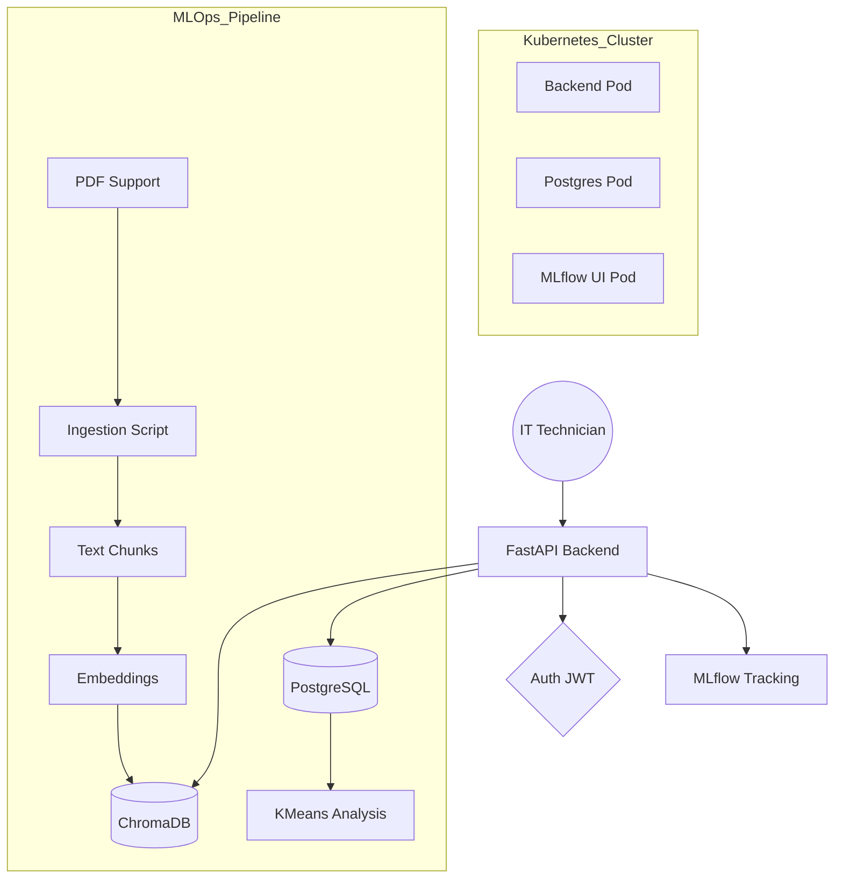

# AI-RAG Assistant for IT Support 

## Project Overview
Conception, industrialization, and supervision of an intelligent RAG (Retrieval-Augmented Generation) assistant designed to help IT technicians find reliable answers from internal documentation (PDF procedures, FAQs, incident reports).

This project transitions from a simple prototype to a production-ready, cloud-native system with integrated ML monitoring and automated CI/CD.

---

##  Technology Stack
- **Backend**: FastAPI (Python 3.13)
- **RAG Engine**: LangChain & LangChain-Community
- **LLM**: Google Gemini 2.0 Flash / Groq (Llama-3.3-70B)
- **Vector Database**: ChromaDB (with HuggingFace Embeddings)
- **Database**: PostgreSQL (Users, Queries, History, Clusters)
- **MLOps**: MLflow (Tracking & Model Registry)
- **DevOps**: Docker, Docker Compose, Kubernetes (Minikube)
- **CI/CD**: GitHub Actions (Lint, Test, Build with Caching)

---

## 🏗 System Architecture


---

##  Getting Started

### 1. Prerequisites
- Docker & Docker Compose
- Minikube & Kubernetes CLI (`kubectl`)
- Lens Desktop (optional but recommended)

### 2. Local Setup (Docker Compose)
```bash
# Clone the repository
git clone https://github.com/saidElamri/airag.git
cd airag

# Create environment file
cp .env.example .env

# Launch services
docker-compose up --build
```

### 3. Kubernetes Deployment (Minikube)
```bash
# Start Minikube
minikube start

# Mount local data (for PDFs and ChromaDB persistence)
minikube mount $(pwd):/home/dicksons/projects/airag

# Apply Kubernetes configurations
kubectl apply -f k8s-deployment.yaml

# Access the service
minikube service rag-backend-service
```

---

##  MLOps & Supervision

### Ingestion & Vector Storage
The system features an **idempotent ingestion** script (`ingest.py`) that only processes the PDF if the vector store is missing or needs updates. It uses `all-MiniLM-L6-v2` for high-performance embeddings.

### MLflow Monitoring
Every query logs rich metadata to MLflow:
- **Metrics**: Latency (`latency_ms`), Similarity Score.
- **Parameters**: Prompt template, LLM model used.
- **Artifacts**: Chunks retrieved from the context.
- **Registry**: The entire RAG pipeline is registered in the MLflow Model Registry.

Access the MLflow UI:
```bash
minikube service mlflow-service
```

### Unsupervised Clustering (Analytics)
Identify frequent IT issues by grouping user questions into topics.
- **Endpoint**: `POST /analytics/cluster`
- **Algorithm**: KMeans clustering on user question embeddings.
- **Result**: Labels stored in PostgreSQL for visualization.

---

##  API Documentation
Once running, explore the interactive documentation via Swagger UI:
- **URL**: `http://<deployment-url>/docs`
- **Key Endpoints**:
    - `POST /auth/login`: Identity management.
    - `POST /query`: RAG assistant question/answer.
    - `GET /history`: User query history.
    - `POST /analytics/cluster`: Trigger topic analysis.

---

##  Industrialization Features
- **Speed-Optimized CI/CD**: GitHub Actions utilizes `GHA type caching` and `buildx` for near-instant builds.
- **Persistence**: PostgreSQL backend ensures user history and analytics are preserved.
- **Scalability**: Kubernetes deployment with health checks and volume management.
- **Security**: Mandatory JWT authentication for all operational endpoints.
